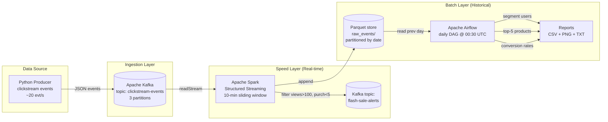

# Architecture - E-Commerce Clickstream & Inventory Watch

## Lambda Architecture overview

## Tech-stack justification

| Layer | Tool | Why this scenario needs it |
|---|---|---|
| Ingestion | **Apache Kafka** | Clickstreams are high-volume, append-only event streams with multiple downstream consumers (real-time + batch). Kafka's partitioned, durable log is the canonical fit; partitioning by `user_id` keeps each user's event order intact for future sessionisation. |
| Stream processing | **Apache Spark Structured Streaming** | The flash-sale rule requires a windowed aggregation (10-minute sliding window) with event-time semantics and watermarking. Spark Structured Streaming expresses this declaratively in a few lines, scales horizontally, and lets us reuse the same DataFrame API for batch processing later. |
| Storage / sink | **Parquet on local FS** | Columnar format = small footprint and fast scan for the daily segmentation/aggregation queries. Parquet partitioning by `event_date` lets Airflow read only the previous day's partition cheaply. (HDFS/S3 substitute equally well; the local FS is just the development surface.) |
| Orchestration | **Apache Airflow** | The batch layer needs a scheduled DAG with multiple parallel tasks (segmentation, top-5, conversion-rate report) plus retries on failure. Airflow's built-in scheduler, UI, retries, and templated `{{ ds }}` data-interval semantics fit this exactly. |
| Local stack | **Docker Compose** | Spinning up Kafka + Zookeeper + Spark + Airflow + Postgres on a laptop without Compose is painful. One file, one command, reproducible across machines. |

## Event time vs processing time

- **Event time** is the `timestamp` field stamped by the producer at the moment a click happens.
- **Processing time** is when Spark sees that record.
- The streaming job uses `withWatermark("timestamp", "2 minutes")` so events that arrive up to 2 minutes late are still folded into the correct 10-minute window. Events older than the watermark are dropped (they would otherwise force Spark to keep windows open forever).
- The Parquet sink partitions on `event_date` derived from event time, so the Airflow batch layer reads slices of historical data by the day the clicks *happened*, not the day Spark wrote them. This is what makes the pipeline tolerant of producer back-pressure or short Kafka outages.
